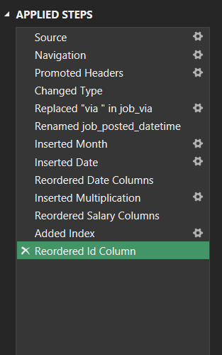
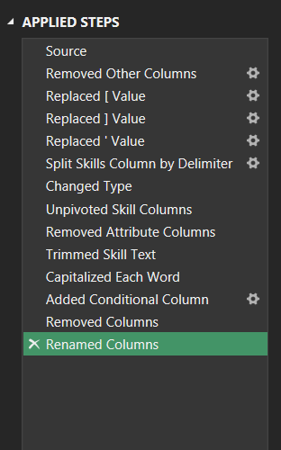
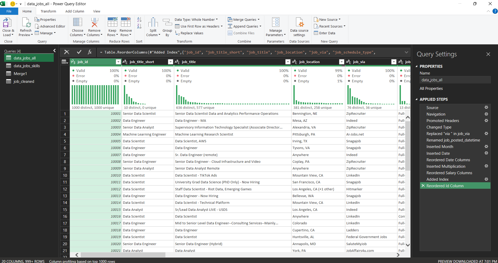
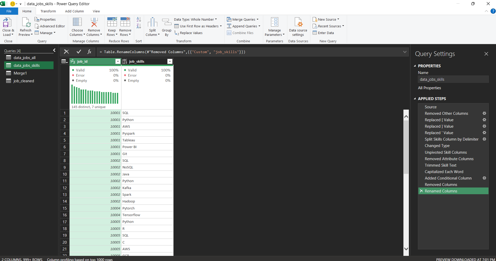
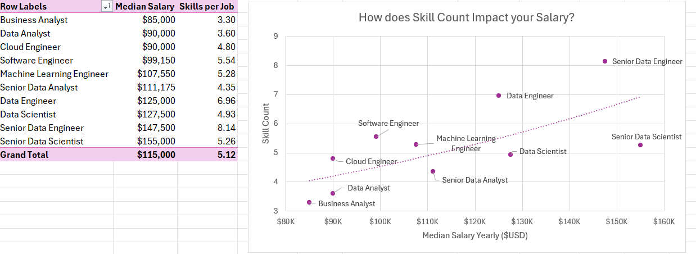

# Introduction

As someone who once navigated the job market myself, I was often struck by how little data was available on the most in-demand roles and skills in the data science field. This motivated me to dive deeper and uncover which skills employers truly value — and how they impact salary potential.
Key Questions Explored

### To gain meaningful insights into the data science job landscape, I focused on the following questions:

1. Do More Skills Lead to Higher Pay?
2. How do data job salaries vary by region?
3. What are the most in-demand skills among data professionals?
4. What is the salary range for the top 10 skills?

### Excel Tools & Techniques Applied

To conduct this analysis, I leveraged a variety of powerful Excel features:

- **Power Query**
- **Pivot Tables**
- **Pivot Charts**
- **Power Pivot**
- **Data Analysis Expressions (DAX)**
  

## Overview of the Dataset

This project uses a dataset of real-world data science job listings from 2023, sourced from an Excel course that introduces users to practical data analysis techniques. It offers rich detail on:

- **Job titles**
- **Salary figures**
- **Countries**
- **Technical skills**

## 1_Do More Skills Lead to Higher Pay?
### Focus Skill: Power Query (ETL)

**Extract**  
To begin, I used Power Query to import the original dataset (data_salary_all.xlsx). I created two main queries:

    One capturing all data job details.  
    Another isolating the skills linked to each job ID.

 **Transform** 
Next, I cleaned and refined both datasets by adjusting column types, removing irrelevant fields, standardizing the text (e.g., trimming whitespace and removing unwanted phrases), and preparing the data for deeper analysis.

 - **data_jobs_all Steps:**  
 
  

- **data_jobs_skills Steps:**  

**Finally, I loaded the cleaned and structured queries into the workbook, laying the groundwork for the analysis that followed.**

- **data_jobs_all Data:**  
 
  

- **data_jobs_skills Data:**  

### Analysis  

**Insights**
- Job postings that list a greater number of required skills generally offer higher median salaries—especially for roles such as Senior Data Engineer and Data Scientist.
- In contrast, positions demanding fewer skills, like Business Analyst, are typically associated with lower salaries, indicating that specialized expertise tends to yield higher compensation in the job market.

## 2_How do data job salaries vary by region?
