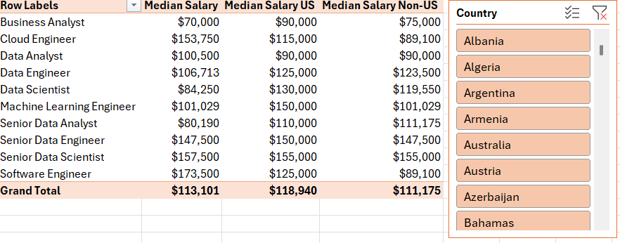
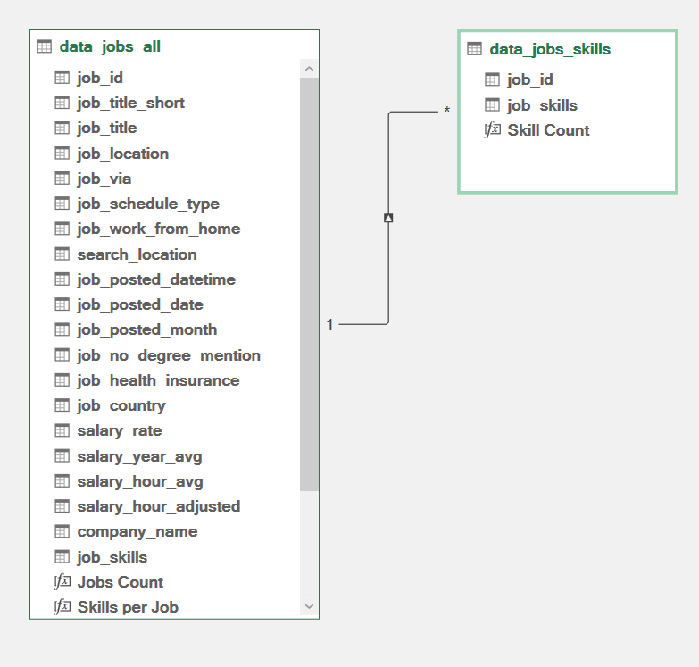
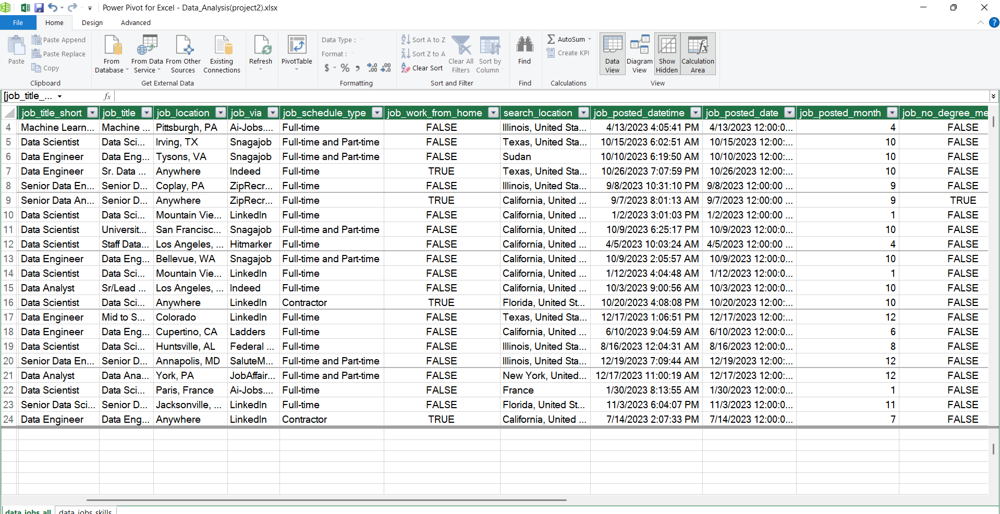
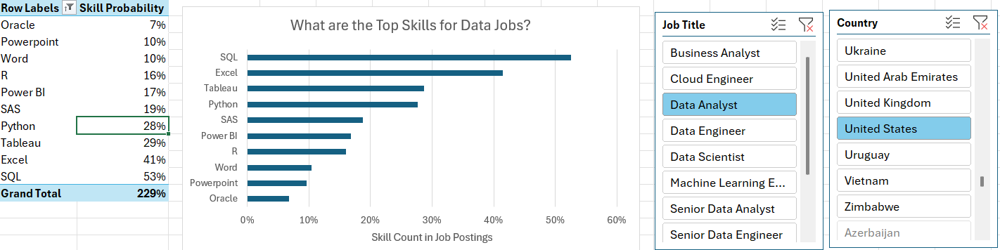
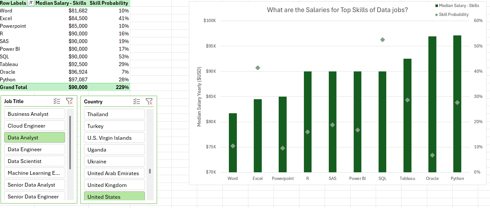

# Introduction

As someone who once navigated the job market myself, I was often struck by how little data was available on the most in-demand roles and skills in the data science field. This motivated me to dive deeper and uncover which skills employers truly value — and how they impact salary potential.
Key Questions Explored

### To gain meaningful insights into the data science job landscape, I focused on the following questions:

  1. **Do More Skills Lead to Higher Pay?**
  2. **How do data job salaries vary by region?**
  3. **What are the most in-demand skills among data professionals?**
  4. **What is the salary range for the top 10 skills?**

### Excel Tools & Techniques Applied

To conduct this analysis, I leveraged a variety of powerful Excel features:

- **Power Query**
- **Pivot Tables**
- **Pivot Charts**
- **Power Pivot**
- **Data Analysis Expressions (DAX)**
  


## Overview of the Dataset

This project uses a dataset of real-world data science job listings from 2023, sourced from an Excel course that introduces users to practical data analysis techniques. It offers rich detail on:

- **Job titles**
- **Salary figures**
- **Countries**
- **Technical skills**

## 1_Do More Skills Lead to Higher Pay?
###  Power Query (ETL) Skill:

**Extract**  
To begin, I used Power Query to import the original dataset (data_salary_all.xlsx). I created two main queries:

  1. One capturing all data job details.  
  2. Another isolating the skills linked to each job ID.

 **Transform** 
Next, I cleaned and refined both datasets by adjusting column types, removing irrelevant fields, standardizing the text (e.g., trimming whitespace and removing unwanted phrases), and preparing the data for deeper analysis.

 - **data_jobs_all Steps:**  
 
  

- **data_jobs_skills Steps:**  


**Finally, I loaded the cleaned and structured queries into the workbook, laying the groundwork for the analysis that followed.**

- **data_jobs_all Data:**  
 
  

- **data_jobs_skills Data:**  


### Analysis  


**Insights**
- Job postings that list a greater number of required skills generally offer higher median salaries—especially for roles such as Senior Data Engineer and Data Scientist.
- In contrast, positions demanding fewer skills, like Business Analyst, are typically associated with lower salaries, indicating that specialized expertise tends to yield higher compensation in the job market.

## 2_How do data job salaries vary by region?

### Skills: PivotTable & DAX

1. Pivot Table Setup
2. I built a PivotTable based on the Data Model created with Power Pivot.
3. Job titles (job_title_short) were placed in the Rows area, while average salaries (salary_year_avg) were added to the Values area.
4. A custom DAX measure was then created to calculate the median salary specifically for jobs located in the United States.

```
=CALCULATE([Median Salary], data_jobs_all[job_country]="United States")
```
### DAX

**I utilized DAX to compute the median annual salary.**

```
Median Salary:=MEDIAN(data_jobs_all[salary_year_avg])
```

### Analysis



**Insights**

- Positions such as Senior Data Engineer and Data Scientist offer significantly higher median salaries both in the U.S. and abroad, reflecting the worldwide demand for advanced data skills.
- The gap in pay between U.S. and non-U.S. roles is especially evident in tech-focused positions, likely due to the strong presence of the tech industry in the United States.

## 3_What are the most in-demand skills among data professionals?

 ### Power Pivot Skill:

  1. I built a data model by connecting the data_jobs_all and data_jobs_skills tables into a unified structure.  
  2. With the data already cleaned in Power Query, Power Pivot automatically established a relationship between the two tables.

 **Data Model**

 - A relationship was created between the tables using the job_id column as the common key.
   

 **Power Pivot Menu**

- I used the Power Pivot menu to fine-tune my data model and efficiently create custom measures for analysis.   
  

  ### Analysis
  

  

  **Insights**

- SQL and Python remain the most in-demand skills for data roles, highlighting their essential function in managing and analyzing data.
- Cloud platforms such as AWS and Azure are increasingly common, signaling the industry's growing focus on cloud computing and large-scale data solutions.


## 4_What is the salary range for the top 10 skills?
### Advanced Charts (Pivot Chart) Skill: 

I built a combo PivotChart to visualize both median salary and skill frequency from the PivotTable:

- **Primary Axis:** Displays median salary using a Clustered Column chart.
- **Secondary Axis:** Shows skill likelihood (%) as a Line with diamond-shaped markers.

To improve readability, I customized the chart by adding titles, removing the connecting lines, and adjusting marker styles.  
### Analysis  


 **Insights**

- Skills such as Python, Oracle, and SQL are tied to higher median salaries, emphasizing their importance in high-paying tech roles.  
- In contrast, tools like PowerPoint and Word are linked with lower salaries and lower demand, reflecting their more general-use nature and limited value in technical job markets.

  ## Conclusion

This project represents a culmination of my skills in Excel-based data analysis, from data extraction and transformation with Power Query to advanced modeling using Power Pivot, custom calculations with DAX, and visual storytelling through PivotTables and PivotCharts.

By independently sourcing, cleaning, modeling, and analyzing a real-world dataset of over 2023 data job listings, I was able to uncover key trends in the data science job market — including the strong relationship between skill specialization and salary, regional differences in compensation, and the most in-demand technical skills.

The entire workflow — from ETL to insight — was developed and implemented by me, showcasing my ability to apply Excel's full analytical toolkit to answer meaningful business questions. This hands-on experience not only deepened my technical knowledge but also demonstrated my capability to deliver data-driven insights that can support career planning and hiring strategies in the data industry.
