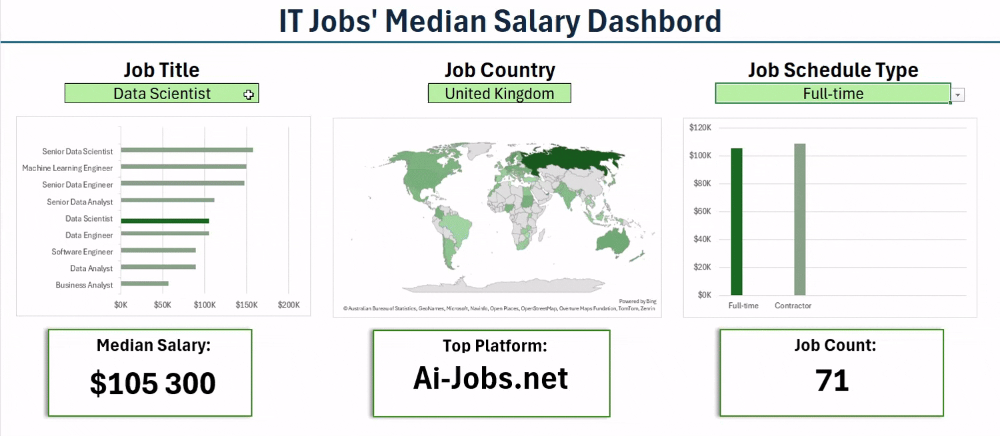

# My Excel Data Analysis Project  
This two-part Excel project explores salary trends in the global data and IT job market through interactive dashboards and targeted analytical questions.

 - The **Salary Dashboard** provides a user-friendly interface to explore job salaries by title, region, and work schedule. It integrates charts, data validation, and conditional formatting to deliver real-time, filterable insights.

  - **The Data Analysis section tackles four key questions:**

        1. Do more skills mean higher pay?  
        2. How do salaries differ by region?  
        3. Which skills are most in demand?  
        4. What is the salary range of top skills?

Using **Power Query, Power Pivot, DAX, and PivotCharts**, this project delivers a multi-dimensional view of the data science job market—designed to be both insightful and technically robust.

## Salary Dashboard

This Excel-based dashboard project was developed as part of my personal learning and skill-building journey in data analysis. The goal was to analyze a real-world dataset containing job market information for data and IT roles and to present the findings in a clear, interactive format.

**The dashboard allows users to explore:**

  - Median salaries across different job titles
  - Geographic salary variations via a world map
  - Job counts filtered by title, country, and schedule type
  - ailored insights based on user-selected filters

By combining advanced Excel features—such as charts, formulas, conditional logic, and data validation—I created a functional tool that not only showcases key trends but also reinforces my proficiency in data storytelling using Excel.

Check out it here: [Salary_Dashboard](Salary_Dashboard)

## Data Analysis
This project explores key patterns in the global data science job market by addressing four essential questions using Excel's advanced analytical tools:

  1. **Do more skills lead to higher pay?**
    Using Power Query for data cleaning and transformation, I examined the correlation between the number of skills listed in job postings and their associated salaries.

  2. **How do data job salaries vary by region?**
    With PivotTables and custom DAX measures in Power Pivot, I compared median salaries across different geographic regions, with a focus on U.S. versus non-U.S. roles.

  3. **What are the most in-demand skills among data professionals?**
    I modeled relationships between datasets to identify and rank technical skills by frequency and visibility, using a structured Data Model in Power Pivot.

  4. **What is the salary range for the top 10 skills?**
    I created a combination PivotChart to visualize both salary distribution and skill likelihood, revealing contrasts between high-value and general-use tools.

By combining structured data modeling, DAX calculations, and visual storytelling through PivotCharts, the project offers a multi-angle look at how skills and location influence compensation in the data industry.

Check out it here: [Data_Analysis](Data_Analysis)

