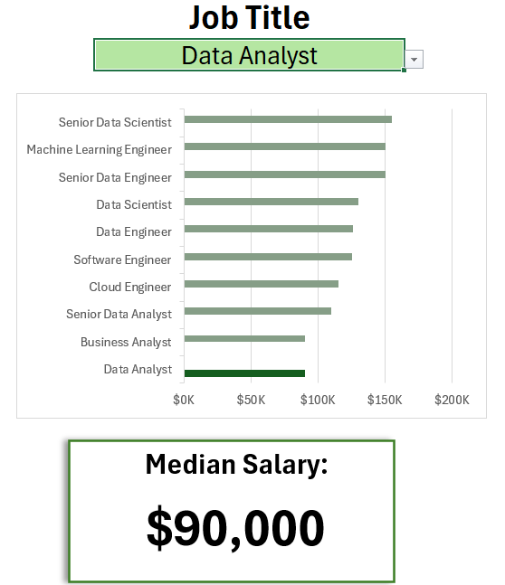
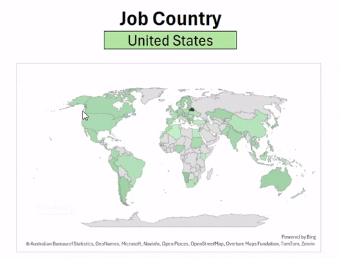
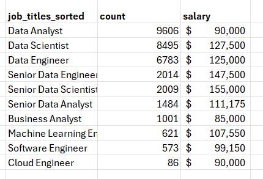
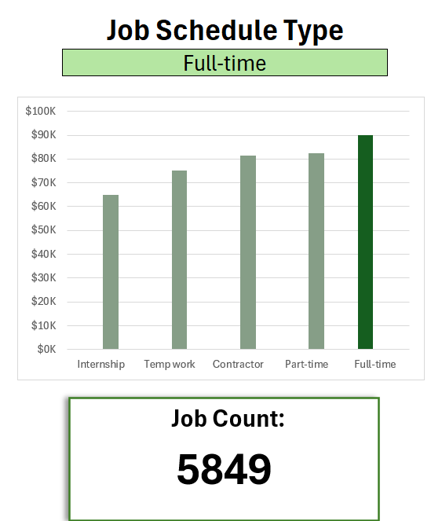
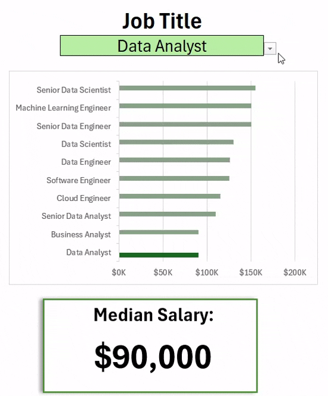

# Median Salary Dashboard for IT Jobs


## Introduction

This dashboard was developed to support job seekers in exploring salary trends for various data-related roles and to help them assess whether they are being fairly compensated.

The data comes from Luke Barrousse's dataset, provided to his youtube subscribers, which offers a solid introduction to analyzing information using Excel. It includes comprehensive details about job titles, salary figures, locations, and in-demand skills, all of which are visualized and summarized in this dashboard.

His YouTube account reference: [Luke Barousee](https://www.youtube.com/@LukeBarousse)

### Dashboard File

The completed dashboard can be found in the file: [Salary_Dashboard(project #1).xlsx](Salary_Dashboard(project1).xlsx)

### Excel Skills Applied

This project utilized the following Excel features:

- Chart creation and visualization
- Formulas and functions for data analysis
- Data validation tools to enhance interactivity

### Dataset Overview

The dataset used in this analysis features real job listings in the data science field from 2023. Provided as part of Luke Barousse's Excel course, it includes detailed insights into:

- Job titles
- Salary data
- Geographic locations
- Key skills

## Dashboard
**Data Jobs Median Salaries - Bar Chart**



1. **Excel Tools Used:** Employed bar charts with formatted salary labels and a clean, user-friendly layout.

2. **Design Approach:** I Chose horizontal bar chart and vertical column chart to make it easier to compare median salaries across roles and schedule types.
3. **Data Structuring:** Job titles were sorted in descending order by salary to enhance clarity and interpretation.
4.  **Insights:** The chart clearly highlights salary patterns, showing that senior-level and engineering roles tend to offer higher pay than analyst positions.

**Median Salaries by Country - Map Chart**



1. **Excel Tools Used:** Used Excel’s map chart to display median salaries by country.

2. **Design Approach:** Applied color gradients to visually distinguish salary ranges across different regions.

3. **Data Display:** Mapped median salary figures for each country with available data.

4. **Visual Clarity:** Enhanced the map’s readability to allow for quick interpretation of geographic trends.

5. **Insights:** The map effectively highlights global salary differences, making it easy to identify both high- and low-paying regions.


### Functions and Formulas
  **Median Salary by Job Title, Country and Schedule Type:**
```
=MEDIAN(IF(
(jobs[job_title_short]=mytitle)*
(jobs[job_country]=mycountry)*
(jobs[salary_year_avg]<>0)*
(ISNUMBER(SEARCH(mytype, jobs[job_schedule_type]))),
 jobs[salary_year_avg]))
```
- **Advanced Filtering:** Applies multiple conditions—job title, country, schedule type—while excluding entries with missing salary data.
- **Array-Based Calculation:** Uses the MEDIAN() function combined with nested IF() statements to process arrays.
- **Focused Results:** Delivers targeted salary figures based on selected job titles, locations, and employment types.
- **Formula Role:** Fills the table with the median salary corresponding to the chosen job title, country, and schedule type.
**Source Table**
    
(Chart illustration shown above)

**Count of Jobs specified by title, country and schedule type**
```
=COUNTIFS(jobs[job_title_short], mytitle, jobs[job_country], mycountry, jobs[job_schedule_type], mytype)
```
- **Method:** The Excel function =COUNTIFS() allows you to filter a large number of job listings based on specific fields such as Job Title, Country, and Schedule Type. As a result, it provides the exact count of jobs that match the given criteria.
**Implementation:**
  
### Data Validation
 **Improved Data Validation:** A filtered list is applied as a data validation rule for the Job Title, Country, and Schedule Type fields in the Data tab. This approach:
- Restricts user input to approved and consistent schedule types
- Prevents errors and invalid entries
- Enhances the overall functionality and user experience of the dashboard
    
## Conclusion

This project demonstrates my ability to turn raw job market data into a clear, interactive, and insightful dashboard using Excel. By applying a range of Excel tools—such as charts, formulas, map visualizations, and data validation—I created a resource that helps job seekers explore salary trends by job title, location, and schedule type.

Through this dashboard, I was able to not only practice key data analysis techniques but also design a user-friendly tool that delivers real value. The project reflects both my analytical skills and my attention to clarity and usability in data presentation.
